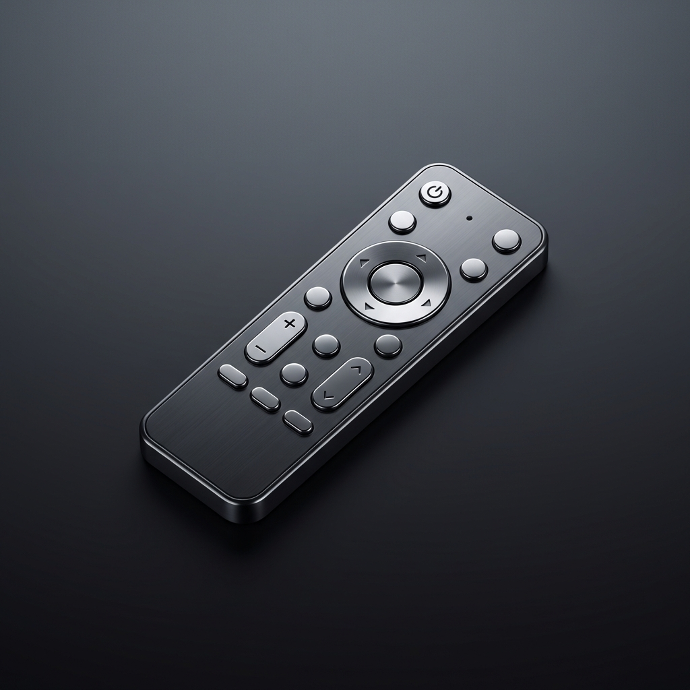

# RemoteGTV 📺

<p align="center">
  
</p>

**RemoteGTV** is a native macOS application designed to control **Android TV** and **Google TV** devices directly from your desktop. It provides a lightweight, responsive, and aesthetically pleasing interface to navigate your TV without needing to reach for the physical remote or your phone.

Built with **SwiftUI** and native system frameworks, it ensures high performance and seamlessly blends with the macOS ecosystem.

---

## ✨ Features

*   **Native macOS Experience**: Designed with modern SwiftUI components for a look and feel that belongs on your Mac.
*   **Auto-Discovery**: Automatically finds Android TV / Google TV devices on your local network using Bonjour (mDNS) / Network Service Discovery.
*   **Secure Pairing**: Implements the official Android TV pairing protocol using TLS certificates for a secure and authenticated connection.
*   **Full Remote Control**: Supports standard navigation keys (D-Pad), Back, Home, Volume control, Mute, and Power.
*   **Keyboard Support**: (Planned) Type on your Mac keyboard to input text on the TV.
*   **Instant Connection**: Remembers previously paired devices for quick reconnection.

## 🛠 Technology Stack

This project is built using:

*   **Language**: [Swift 5.9+](https://swift.org/)
*   **Framework**: Swift Package Manager (SPM)
*   **UI Framework**: [SwiftUI](https://developer.apple.com/xcode/swiftui/)
*   **Architecture**: MVVM with Modular Structure (Core, Network, UI)
*   **Networking**: `Network.framework` (NWConnection) for raw TCP/TLS socket communication.
*   **Protocol**: Custom implementation of the **Android TV Remote Protocol v2**.
*   **Security**: Native `Security` framework for generating self-signed RSA certificates required for the pairing handshake.

## 🚀 How to Build & Install

### Prerequisites
*   macOS 14.0 (Sonoma) or later.
*   Xcode 15+ (for Swift compiler tools) or just the Command Line Tools.

### Building from Source

There is no need to open Xcode for a quick build. The project includes a shell script to compile and bundle the app automatically using Swift Package Manager.

1.  **Clone the repository:**
    ```bash
    git clone https://github.com/geosub-m/RemoteGTV.git
    cd RemoteGTV
    ```

2.  **Run the build script:**
    ```bash
    ./build_app.sh
    ```
    This script will:
    *   Build the project using `swift build -c release`.
    *   Generate the `RemoteGTV.app` bundle.
    *   Create the application icon.
    *   Sign the application (ad-hoc).

3.  **Run the App:**
    The application will be created in the project folder as `RemoteGTV.app`. You can double-click it or move it to your `/Applications` folder.

### Running Tests

This project uses **XCTest**. You can run all tests using:

```bash
swift test
```

## 📂 Project Structure

The project follows the standard Swift Package Manager structure with organized submodules:

*   `Package.swift`: The package manifest defining targets and dependencies.
*   `Sources/RemoteGTV/`:
    *   **Core/**:
        *   `Logger.swift`: Centralized logging system.
    *   **Network/**:
        *   `NetworkManager.swift`: Main coordinator for connection and state.
        *   `DiscoveryManager.swift`: Handles Bonjour/mDNS device discovery.
        *   `RemoteProtocol.swift`, `ProtocolBuffer.swift`: Protocol definitions and serialization.
        *   `CryptoUtils.swift`, `CertUtils.swift`: Cryptography and Identity management.
    *   **UI/**:
        *   `RemoteTVApp.swift`: App entry point.
        *   `ContentView.swift`: Main view assembly.
        *   `Theme.swift`: Centralized design system (Colors, Layout).
        *   **Components/**: Reusable UI views (`DeviceList.swift`, `DirectionalPad.swift`, `NeumorphicButton.swift`, etc.).
*   `Tests/RemoteGTVTests/`:
    *   Unit tests for Protocol execution, data serialization, and cryptographic logic using `XCTest`.

## 🤝 Contributing

Contributions are welcome! If you find a bug or want to suggest a new feature (like Voice Search or App launching), feel free to open an issue or submit a pull request.

## 📄 License

This project is open-source. Feel free to use and modify it.

---
*Disclaimer: "Android TV" and "Google TV" are trademarks of Google LLC. This project is an unofficial client and is not affiliated with Google.*
